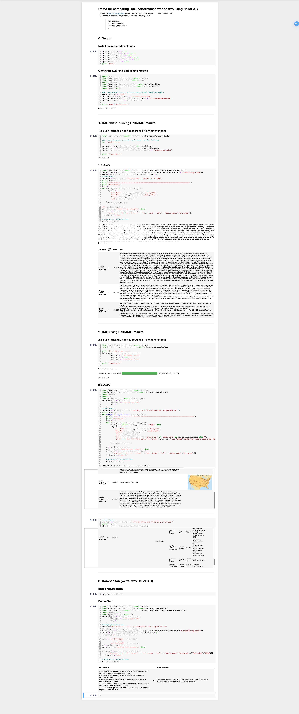

# Llamaindex demo
* Clone this repo
* Install [jupyter](https://jupyter.org/install)
* Run `jupyter notebook`
* Open `local_file_demo_for_comparison.ipynb.ipynb`
* Setup your OpenAI API key
* Just compare the results with and without HelloRAG
* 